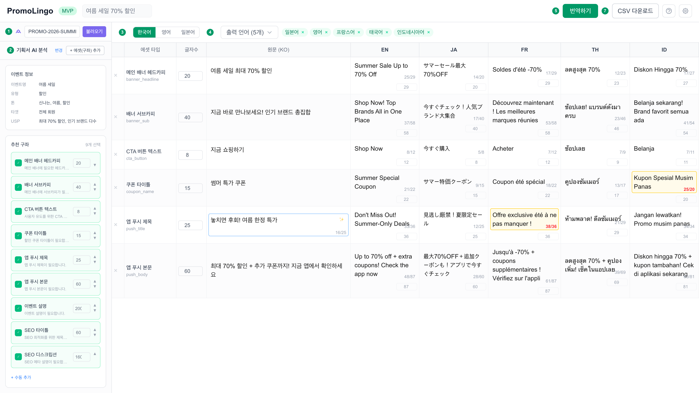

# PromoLingo

> 이커머스 프로모션 문구 초안 자동 생성 및 다국어 번역 도구

PromoLingo는 이커머스 기업의 글로벌 프로모션 운영 과정에서 발생하는 **다국어 번역 병목**을 해소하기 위해 만들어진 AI 기반 번역 워크벤치입니다.



---

## 제작 배경

이커머스 프로모션을 글로벌로 운영할 때, 하나의 이벤트에 수십 개의 에셋(배너 헤드카피, 서브카피, CTA 버튼, 푸시 알림 등)이 필요하고, 이를 10개 이상의 언어로 번역해야 합니다.

기존 워크플로우의 문제점:

- **수작업 반복**: 에셋마다 번역 요청서를 작성하고, 번역 결과를 스프레드시트에 수동으로 정리
- **컨텍스트 누락**: 번역가에게 이벤트의 목적, 톤앤매너, 글자수 제한 등 컨텍스트가 충분히 전달되지 않음
- **품질 편차**: 글로서리, 금칙어 등 번역 가이드라인이 체계적으로 관리되지 않아 언어별 품질 편차 발생
- **반복 수정**: 글자수 초과, 뉘앙스 불일치 등으로 여러 차례 수정 요청 발생

PromoLingo는 기획서 분석부터 번역, 검수, CSV 내보내기까지 **하나의 화면에서 모든 작업을 완료**할 수 있도록 설계되었습니다.

---

## 주요 기능

### 1. ClickUp 태스크 연동 (예정)
- ClickUp 태스크 카드를 검색하여 이벤트 개요와 할당된 구좌(에셋) 정보를 자동으로 가져옵니다.
- 현재는 검색바 UI만 구현되어 있으며, API 연동은 추후 진행 예정입니다.

### 2. 기획서 AI 분석
- PDF 파일 또는 텍스트 형태의 기획서를 입력하면, AI가 이벤트의 목적, 타겟 고객, 톤앤매너, 핵심 셀링포인트를 자동으로 분석합니다.
- 분석 결과를 바탕으로 에셋 타입별 원문 초안을 자동 생성합니다.
- 원문 생성 후 추가 아이디어가 필요할 때, 에셋별로 AI 카피 옵션 팝업을 통해 3~5개의 대안을 즉시 제공합니다.

### 3. 스프레드시트 기반 번역 워크벤치
- TanStack Table 기반의 스프레드시트 UI로 에셋별, 언어별 번역 결과를 한눈에 확인할 수 있습니다.
- **재생성 (Regenerate)**: 마음에 들지 않는 번역을 새로운 표현으로 재생성
- **글자수 줄이기 (Shorten)**: 글자수 제한을 초과한 번역을 의미를 유지하면서 축약
- **실시간 글자수 카운트**: 에셋별, 언어별 글자수 제한을 실시간으로 표시하고 초과 시 경고
- **셀 직접 편집**: 번역 결과를 직접 클릭하여 수정 가능

### 4. 다국어 동시 번역
- 한국어, 영어, 일본어 중 원문 언어를 선택하고, 최대 11개 언어로 동시 번역합니다.
- 기획서 분석 컨텍스트(이벤트 목적, 톤앤매너 등)가 번역 프롬프트에 자동 반영되어 단순 직역이 아닌 마케팅 맥락에 맞는 번역을 생성합니다.

### 5. 관리자 설정
- **에셋 프리셋 관리**: 에셋 타입별 기본 글자수 제한, 활성화/비활성화 설정
- **번역 TMS 관리** (예정): 글로서리, 금칙어, 번역 지침 프롬프트 등 전체 번역 품질 관리
- 프롬프트 템플릿에 `{{glossary_section}}`, `{{forbidden_words_section}}` 플레이스홀더가 이미 준비되어 있어 확장이 용이합니다.

### 6. CSV 내보내기
- 완성된 번역 결과를 CSV 파일로 내보내 CMS, 광고 플랫폼 등에 바로 적용할 수 있습니다.

### 7. 온보딩 튜토리얼
- 첫 방문 시 7+1단계 워크플로우 가이드가 자동으로 표시됩니다.
- 이후에도 헤더의 `?` 버튼을 통해 언제든 다시 확인할 수 있습니다.

---

## 지원 언어

| 코드 | 언어 | 바이트 타입 |
|------|------|------------|
| `ko` | 한국어 | multi-byte |
| `en` | 영어 | single-byte |
| `ja` | 일본어 | mixed |
| `fr` | 프랑스어 | single-byte |
| `th` | 태국어 | multi-byte |
| `id` | 인도네시아어 | single-byte |
| `vi` | 베트남어 | single-byte |
| `zh-TW` | 중국어 번체 | multi-byte |
| `es` | 스페인어 | single-byte |
| `pt` | 포르투갈어 | single-byte |
| `zh-CN` | 중국어 간체 | multi-byte |

각 언어별로 글자수 보정 계수(lengthCoefficient)가 설정되어 있어, 원문 대비 번역문의 길이 변화를 예측할 수 있습니다.

---

## 기술 스택

| 카테고리 | 기술 |
|---------|------|
| **프레임워크** | Next.js 16 (App Router) |
| **언어** | TypeScript |
| **UI** | React 19, Tailwind CSS v4 |
| **스프레드시트** | TanStack Table v8 |
| **AI** | OpenAI GPT-4o-mini |
| **PDF 파싱** | pdf-parse |
| **상태 관리** | React Hooks + localStorage |
| **배포** | Vercel (예정) |

---

## 아키텍처

```
src/
├── app/                          # Next.js App Router
│   ├── api/                      # API Route Handlers
│   │   ├── analyze-brief/        # 기획서 AI 분석 엔드포인트
│   │   ├── translate/            # 번역 엔드포인트
│   │   ├── retranslate/          # 재번역 (재생성/축약) 엔드포인트
│   │   └── source-options/       # AI 카피 옵션 생성 엔드포인트
│   ├── layout.tsx                # 루트 레이아웃
│   └── page.tsx                  # 메인 페이지 (상태 관리 허브)
│
├── components/
│   ├── brief/                    # 기획서 분석 패널
│   │   └── BriefSidePanel.tsx    # 좌측 사이드 패널 (PDF/텍스트 입력 → AI 분석)
│   ├── clickup/                  # ClickUp 연동
│   │   └── ClickUpSearchBar.tsx  # 태스크 검색바 UI
│   ├── common/                   # 공통 컴포넌트
│   │   ├── Button.tsx
│   │   ├── Modal.tsx
│   │   ├── StepBadge.tsx         # 워크플로우 단계 배지
│   │   └── Toast.tsx
│   ├── event/                    # 이벤트 설정
│   │   ├── AssetConfigModal.tsx  # 에셋 구성 모달
│   │   ├── AssetTypeSelector.tsx # 에셋 타입 선택기
│   │   └── EventSetForm.tsx      # 원문/출력 언어 선택 폼
│   ├── layout/                   # 레이아웃
│   │   ├── Header.tsx            # 상단 헤더 (번역/다운로드/설정)
│   │   └── Toolbar.tsx
│   ├── onboarding/               # 온보딩
│   │   └── TutorialOverlay.tsx   # 7+1단계 튜토리얼 오버레이
│   ├── settings/                 # 관리자 설정
│   │   └── AssetPresetDBModal.tsx # 에셋 프리셋 설정 모달
│   └── spreadsheet/              # 스프레드시트 영역
│       ├── ColumnHeader.tsx      # 컬럼 헤더 (언어별 글자수 설정)
│       ├── EditableCell.tsx      # 편집 가능한 셀
│       ├── SourceOptionsPopup.tsx # AI 카피 옵션 팝업
│       └── SpreadsheetGrid.tsx   # 메인 스프레드시트 그리드
│
├── constants/
│   ├── assetTypes.ts             # 에셋 타입 프리셋 정의
│   ├── languages.ts              # 지원 언어 및 글자수 보정 계수
│   └── prompts.ts                # 번역 프롬프트 템플릿
│
├── hooks/
│   ├── useAssetPresetDB.ts       # 에셋 프리셋 DB (localStorage)
│   ├── useLocalStorage.ts        # localStorage 동기화 훅
│   ├── useSpreadsheet.ts         # 스프레드시트 상태 관리
│   └── useTranslation.ts         # 번역 API 호출 관리
│
├── lib/
│   ├── csv.ts                    # CSV 생성 및 다운로드
│   ├── openai.ts                 # OpenAI API 래퍼 (번역, 분석, 카피 생성)
│   └── storage.ts                # 데이터 영속성 유틸리티
│
└── types/
    ├── event.ts                  # 이벤트/에셋 타입 정의
    ├── glossary.ts               # 글로서리/번역 지침 타입 정의
    └── translation.ts            # 번역 그리드/셀 상태 타입 정의
```

### 데이터 흐름

```
기획서 입력 → AI 분석 (GPT-4o-mini)
    ↓
에셋 + 원문 자동 생성
    ↓
번역 실행 → 언어별 병렬 API 호출
    ↓
스프레드시트 렌더링 (TanStack Table)
    ↓
셀별 재생성/축약/직접 편집
    ↓
CSV 내보내기
```

### 상태 관리 전략
- **서버 상태**: Next.js API Routes를 통한 OpenAI API 호출 (API 키 서버 사이드 보호)
- **클라이언트 상태**: React `useState` + `useCallback`으로 스프레드시트 데이터 관리
- **영속 상태**: `useLocalStorage` 커스텀 훅으로 이벤트명, 언어 설정, 에셋 프리셋, 튜토리얼 상태 등을 localStorage에 자동 저장

---

## 워크플로우

```
① ClickUp 카드 불러오기
    → 이벤트 개요와 구좌 정보 취합

② 기획서 AI 분석
    → PDF/텍스트 기획서 입력 → 이벤트 목적, 톤앤매너 분석 → 에셋별 원문 자동 생성

③ 원문 언어 선택
    → 한국어 / 영어 / 일본어 중 택 1

④ 출력 언어 선택
    → 번역 대상 언어 복수 선택 (최대 11개)

⑤ 번역하기
    → AI가 모든 에셋 × 모든 언어 동시 번역

⑥ 시트에서 수정
    → 재생성(↻), 글자수 줄이기(✂), 직접 편집으로 최종 다듬기

⑦ CSV 다운로드
    → 완성된 결과를 CSV로 내보내기

⚙ 관리자 설정
    → 에셋 프리셋 관리, 번역 TMS(글로서리/금칙어/지침) 관리
```

---

## 시작하기

### 사전 요구사항

- Node.js 18 이상
- OpenAI API 키

### 설치

```bash
git clone https://github.com/yourusername/promolingo.git
cd promolingo
npm install
```

### 환경 변수 설정

프로젝트 루트에 `.env.local` 파일을 생성합니다:

```env
OPENAI_API_KEY=your-openai-api-key-here
```

### 실행

```bash
npm run dev
```

브라우저에서 [http://localhost:3000](http://localhost:3000)을 열면 PromoLingo를 사용할 수 있습니다.

### 빌드

```bash
npm run build
npm start
```

---

## 에셋 타입 프리셋

PromoLingo는 이커머스 프로모션에서 자주 사용되는 에셋 타입이 사전 정의되어 있습니다:

| 에셋 타입 | 설명 | 기본 글자수 |
|----------|------|-----------|
| 메인 배너 헤드카피 | 메인 배너의 핵심 문구 | 20자 |
| 배너 서브카피 | 배너 보조 설명 문구 | 40자 |
| CTA 버튼 텍스트 | 클릭 유도 버튼 문구 | 8자 |
| 푸시 알림 타이틀 | 푸시 알림 제목 | 15자 |
| 푸시 알림 본문 | 푸시 알림 내용 | 40자 |
| 인앱 팝업 | 앱 내 팝업 문구 | 30자 |
| 상품 뱃지 | 상품에 부착되는 뱃지 텍스트 | 6자 |
| 이벤트 타이틀 | 이벤트 페이지 제목 | 25자 |
| 이벤트 설명 | 이벤트 상세 설명 | 100자 |
| 쿠폰 문구 | 쿠폰 안내 텍스트 | 20자 |

관리자는 ⚙ 설정에서 글자수 제한을 자유롭게 조정하고, 사용하지 않는 에셋 타입을 비활성화할 수 있습니다.

---

## 향후 계획

- [ ] ClickUp API 연동 (태스크 카드 자동 불러오기)
- [ ] 번역 TMS 관리 (글로서리, 금칙어, 번역 지침 프롬프트)
- [ ] 번역 히스토리 및 버전 관리
- [ ] 팀 협업 기능 (Supabase 등 DB 연동)
- [ ] Vercel 배포 및 인증 시스템
- [ ] Slack/Teams 알림 연동

---

## 라이선스

MIT License
